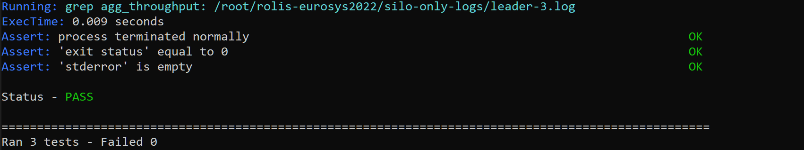

Welcome to the Rolis artifact for our Eurosys'22 submission. 

_Rolis: a software approach to efficiently replicating multi-core transactions_

## Project organization
 - `benchmarks`
   - `benchmarks/sto`: Transaction control, serialization (in `Transactions.cc`) and replay interface implementation (in `ReplayDB.cc`)
   - `benchmarks/tpcc.cc`: TPC-C benchmark implementation
   - `benchmarks/micro_bench.cc`: YCSB++ benchmark implementation
 - `docker`: the docker container
 - `scripts`: several experimental scripts and scripts to plot figures in the paper
 - `third-party`: the dependencies on MultiPaxos ported from Janus with the leader election
 - `dbtest.cc`: the `main()` portal to start the program, including replay logic

 You can find a more detailed document in [modules](./documents/code.md).

## Run the experiment locally
In this section, you can set up Rolis locally for testing and verification, which is mainly for badges `Artifacts Available` and `Artifacts Evaluated - Functional`.

### Obtain a Docker container
We run all our codes on `ubuntu 18.04` which mainly depends on several Linux libraries (i.e., boost, gcc and libyaml-cpp-dev). We provide a docker image with all required dependencies and source code for ease **so you can run on any local machine supporting Docker**. You can directly build a runnable Rolis instance with all required dependencies and source code via
```bash
cd ~
git clone https://github.com/stonysystems/rolis.git
cd ~/rolis
cd ./docker
bash docker.sh
```

### Minimal working examples locally
You can start Rolis instance locally (*using different processes to mimic actual distributed environment*) to verify the functionability of the program through three minimal experiments: 
 * two running replicas without failure; 
 * Silo only;
 * three replicas with failure;

```bash
# 1. enter the docker container
docker exec -it ubuntu_eurosys2022 /bin/bash

# 2. run 3 minimal experiments (inside the container): 
make paxos
cd ./test && bash ./runner.sh
```

We should observe status "PASS" in green at the end of experiments as below


## Run the expriment in actual distributed environment
Before moving on, please make distributed environment ready in [environment](./env.md). 


We provide one-click runnable to generate all results under folder `./results`. It would take up to 2 ~ 3 hours to run all experiments.
```bash
# on the leader replica
cd ~/rolis
bash one-click.sh
```