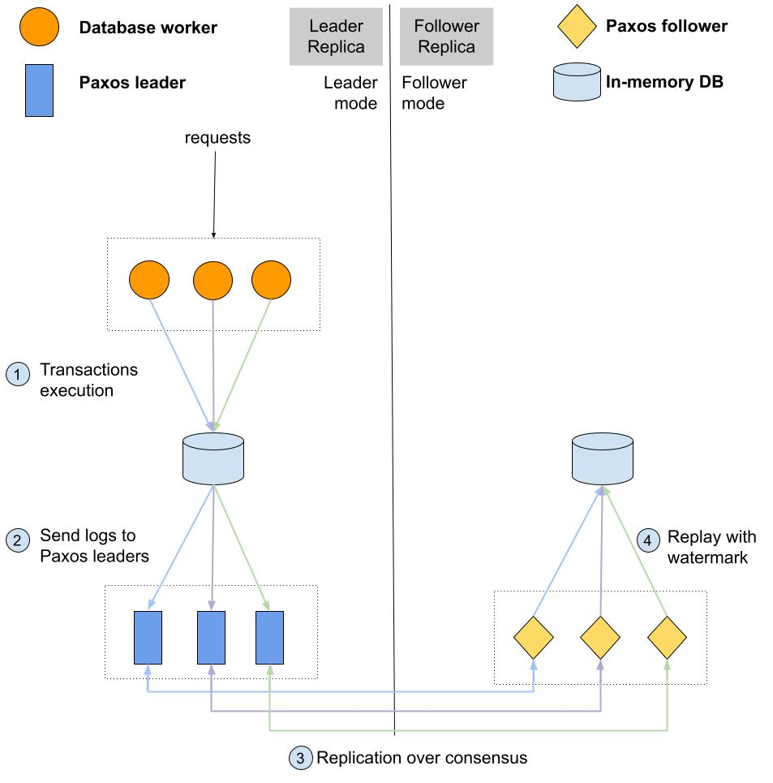

## Detailed description about Rolis

### Architecture

The data-flow of Rolis as follows,
* the embeded threads on the leader replica keep generating TPC-C or YCSB+ transaction workloads and feed those transactions into Silo DB engine
* Silo serializes and executes transactions as what it did in the original paper, then
* Rolis serializes transactions into logs and obtains a timestamp from *RDTSCP*
* DB workers from Silo send corresponding logs to its underlying Paxos streams (*to its leader of the Paxos stream*)
* Those MultiPaxos streams replicate logs to follower replicas
* For each follower replica, it will replay durability committed transactions with watermark control

## Modules
### Benchmark 
We mainly conducted experiments under two benchmarks: TPC-C and YCSB++. Rolis uses dedicated threads to generate those workloads, you can find the implementation respectively in `tpcc.cc` and `micro_bench.cc`.

### Serialize transactions into logs
Rolis serialized write-set of transactions into logs which to be sent through network by Paxos(Please check Figure 6 in our paper for detailed information). The implementation is under `Transaction::serialize_util()` in `Transaction.cc`.

### Paxos implementation
Rolis borrowed a lot from MultiPaxos implementation from Janus. You can find the implementation in `./third-party/Paxos`.

The MultiPaxos implementation is provided as a library and is complete with a failure recovery module.
* The API of the library is defined in `s_main.h`. `setup() and setup2()` are used to intialize the library.
* `add_log_to_nc` is utilized to submit to MultiPaxos streams, as defined in `paxos_main_helper.cc`
* `paxos_main_helper.cc` also contains the logic for leader election of a machine, the election monitor thread runs `electionMonitor`, while `stuff_todo_leader_election` contains the instructions that need to be executed post leader election.
* Each MultiPaxos stream on a machine has a `PaxosWorker` defined in `paxos_worker.cc` associated with it, which controls the submit procedure to MultiPaxos log.
* The lifecycle of a MultiPaxos log is controlled via a coordinator as defined in `BulkCoordinatorMultiPaxos in coordinator.h`, which executes the MultiPaxos algorithm phases as implemented in `coordinator.cc`.
* The server side of execution logic of MultiPaxos RPCs are defined in `paxos/server.cc`.

### Replay logic
* We had a dedicated thread to advance watermark, please check class definition `sync_logger` in `sync_util.hh`.
* Replay API implementation: we implement all replay associated interfaces in `ReplayDB.h`
* Replay invocation: Rolis has replay threads to invoke replay interfaces to replay transactions as we expected. You can find the watermark control logic in `dbtest.cc` which is also the bootstrap script for the program.