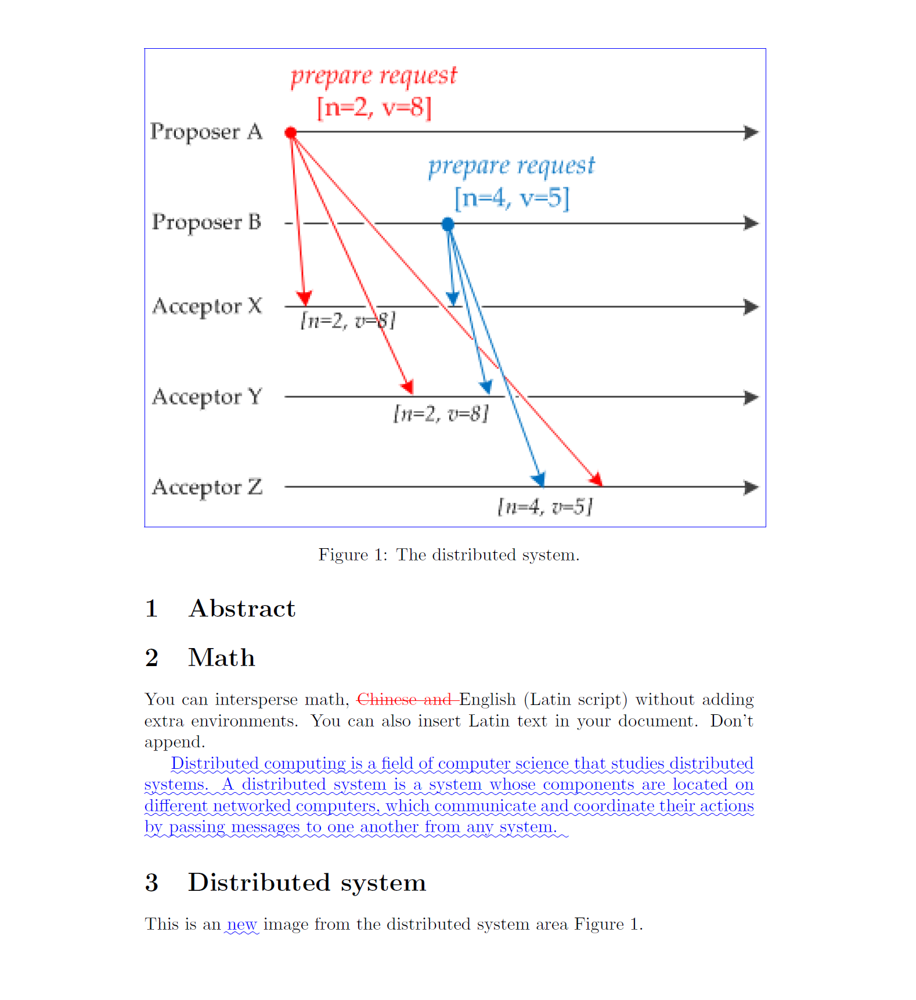

# git-latexdiff usage
git-latexdiff is a tool to graphically visualize differences between different versions of a LaTeX file. Technically, it is a wrapper around git and latexdiff. The source code is https://gitlab.com/git-latexdiff/git-latexdiff. 

## Installation
1. install perl for windows from https://strawberryperl.com/, then test it on the cmd prompt `perl --version`
2. install `git-bash for windows` from https://gitforwindows.org/
3. install `make`. 
   1. Go to [ezwinports](https://sourceforge.net/projects/ezwinports/files/)
   2. Download `make-4.3-without-guile-w32-bin.zip` (get the version without guile)
   3. Extract zip. Copy the contents to your `C:\Program Files\Git\mingw64\` merging the folders, but do NOT overwrite/replace any existing files. (You can find the path via `cd / && explorer .` on git-bash)
   4. install `MikTex` from https://miktex.org/download
4. install `git-latexdiff`
   ```bash
   # open the git-bash for windows to clone the source code
   git clone https://gitlab.com/git-latexdiff/git-latexdiff.git

   # open the cmd prompt to install git-latexdiff
   windows_install.cmd

   # check if latexdiff is properly installed
   latexdiff --version
   ```

## Usage example
```bash
# open git-bash for windows
git clone https://github.com/shenweihai1/latex-rep-example
cd latex-rep-example

# show the help
git latexdiff -h

# show diff between the HEAD and local
# git latexdiff -o diff.pdf HEAD --

# show diff between two commits
git latexdiff -o diff.pdf 15639f2924b29f45f31506bdbe1d9842735c169f 2843607bfb91a6172f83feef32b3c741234c442c
```
The result as below, the new added materials are highlighted in blue and the deletion in red.
